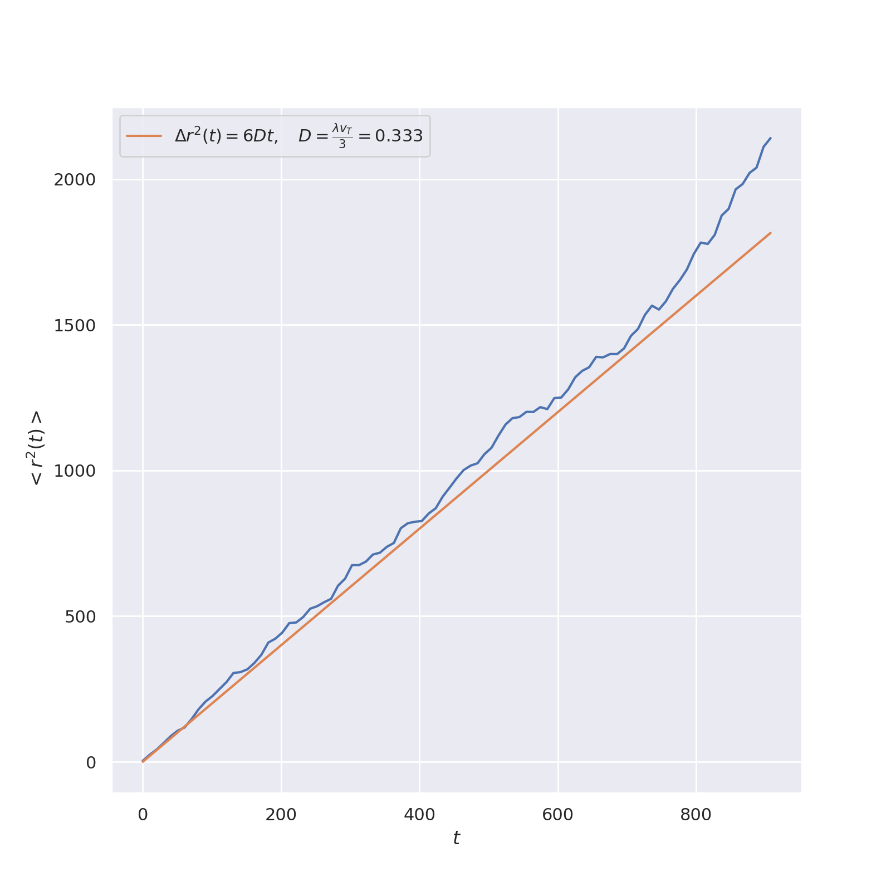
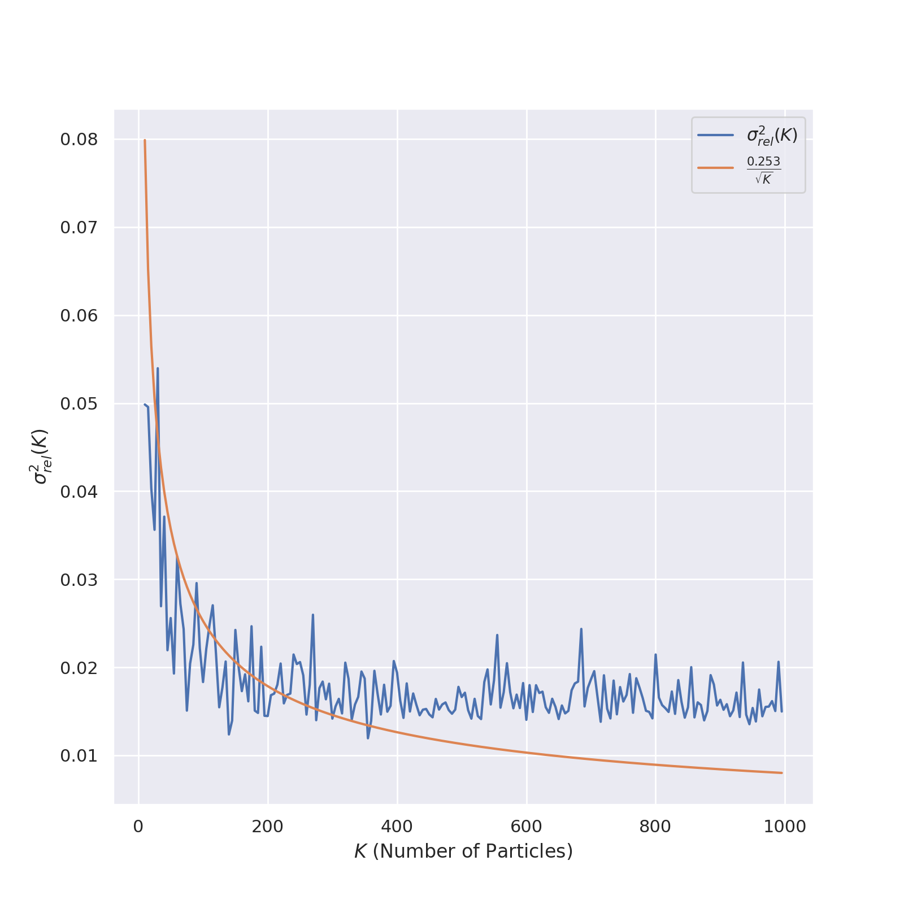

# Determination of the Diffusion Coefficient using Monte Carlo Method

## Distribution Function

## Mean Squared Displacement
We verify the Stokes-Einstein law for diffusion.

## Monte Carlo Error Analysis

## MSD for Different Differential Electron-Scattering Cross Sections

